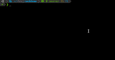
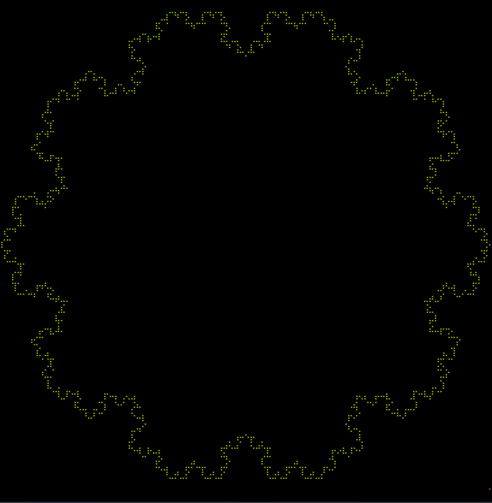

# Unidraw

A WIP C++ library to draw unicode pixels in a terminal using ncurses. It is based on drawille and sfml.

## Particle System

| Gravity                                      | No Gravity                                         |
| -------------------------------------------- | -------------------------------------------------- |
|  |  |

## Von Koch

| Polygon 5                          | Polygon 10                           |
| ---------------------------------- | ------------------------------------ |
|  |  |

