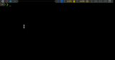

# Unidraw

 A WIP C++ library to draw in a terminal using ncurses. It is based on drawille and sfml.

## Particle System

| Gravity                                                      | No Gravity                                                   |
| ------------------------------------------------------------ | ------------------------------------------------------------ |
|  |  |

## Von Koch

| Polygon 5                                                    | Polygon 10                                                   |
| ------------------------------------------------------------ | ------------------------------------------------------------ |
|  |  |

